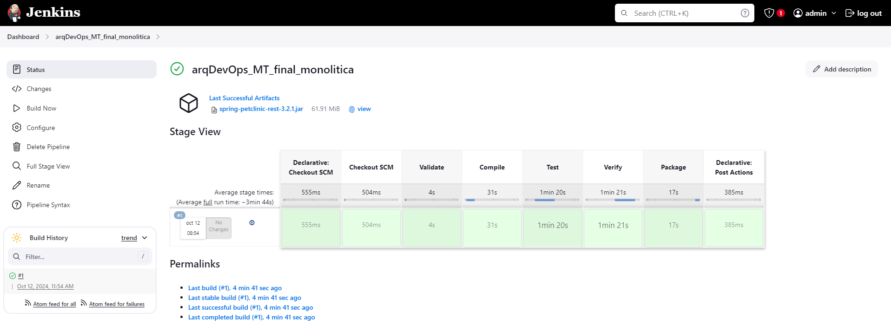
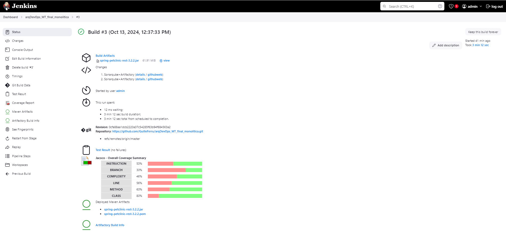
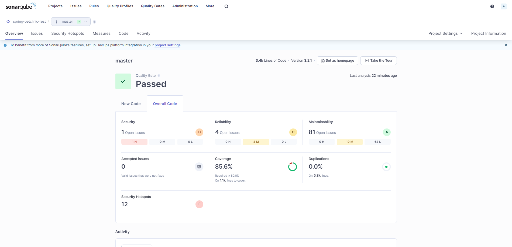
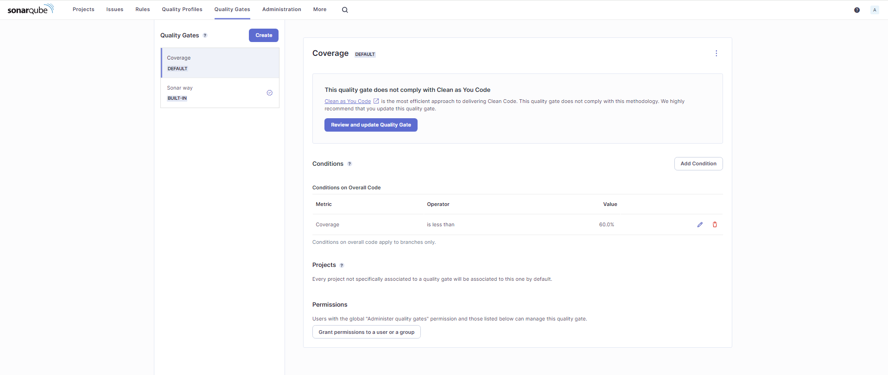
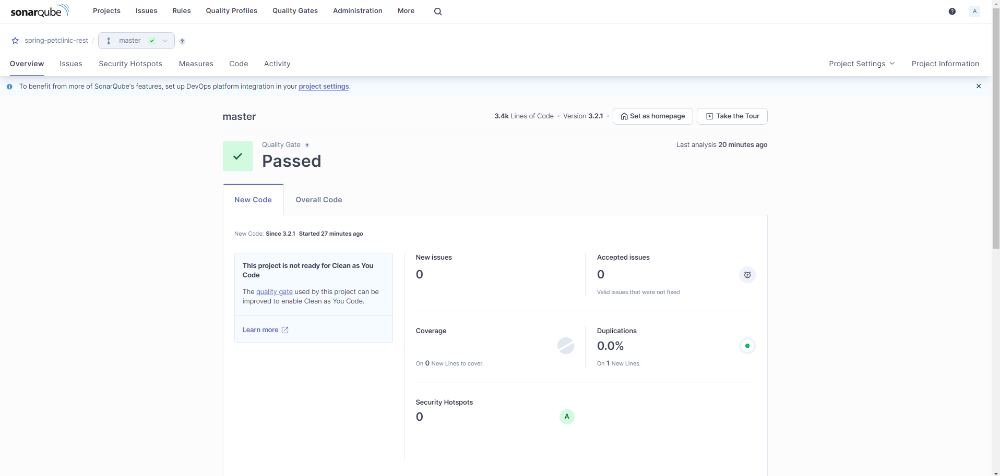
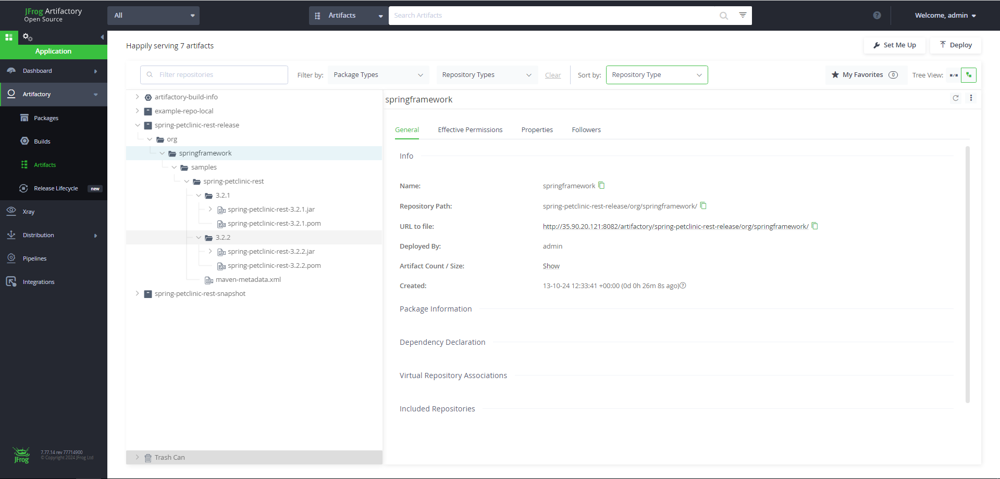
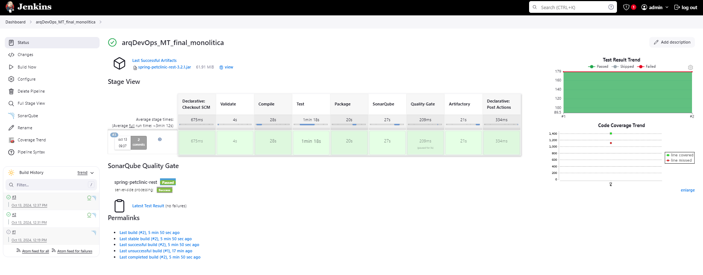

# Tipo de Aplicación: Monolítica

## Nro 1 - Infraestructura en AWS

Se ha creado una infraestructura automatizada en AWS utilizando **Terraform**. Esta infraestructura incluye una instancia EC2 sobre la cual se desplegaron varios servicios clave mediante **Ansible**:

- **Jenkins**: Para la gestión de pipelines de integración continua.
- **SonarQube**: Para el análisis de calidad de código y la implementación de reglas de control de calidad.
- **Artifactory**: Para la gestión de artefactos.

Puedes acceder al repositorio con la configuración de la infraestructura y su código fuente en este [enlace](https://github.com/GuilleFerru/arqDevOps_MT_final_aws.git).

## Nro 2 - Build + Crear Artefacto

El pipeline de Jenkins definido en el archivo `Jenkinsfile` automatiza la construcción del proyecto monolítico. Este pipeline utiliza una imagen de Docker con **Maven** y **Temurin JDK 17** para llevar a cabo los siguientes pasos:

1. **Declarative Checkout SCM**:
   - Clona el repositorio desde la rama `master` de [este enlace](https://github.com/GuilleFerru/arqDevOps_MT_final_monolitica.git). No es necesario realizar esta tarea ya que Jenkins  la ejecuta de manera automatica, se coloca solo a fines ejemplificativos.

2. **Validación (Validate)**:
   - Ejecuta el comando `mvn validate` para comprobar que el proyecto está correctamente configurado y es válido.

3. **Compilación (Compile)**:
   - Compila el código fuente con `mvn compile`.

4. **Pruebas (Test)**:
   - Ejecuta las pruebas unitarias con `mvn clean test`.

5. **Verificación (Verify)**:
   - Ejecuta el comando `mvn verify`, que verifica el proyecto y realiza cualquier tarea de calidad o validación adicional configurada.

6. **Empaquetado (Package)**:
   - Genera el archivo ejecutable (`JAR`) utilizando `mvn clean package -DskipTests`.

7. **Publicación**:
   - Si el pipeline es exitoso, se archivan los artefactos `.jar` generados y se limpia el espacio de trabajo.

Puedes ver una ilustración del proceso a continuación:



## Nro 3 - Jenkins Pipeline Completo

Este pipeline no solo construye el artefacto, sino que también genera reportes de prueba con **Junit**, cobertura de código con **Jacoco**, análisis de calidad de código con **SonarQube** y publica los artefactos generados en **Artifactory**:

1. **Pruebas (Test)**:
   - Ejecuta las pruebas unitarias con `mvn clean test` y genera reportes de prueba y cobertura de código.

   

2. **SonarQube**:
   - Ejecuta el análisis de calidad del código utilizando el plugin de Maven y reporta los resultados a SonarQube en la rama detectada.

   

3. **Quality Gate**:
   - Espera el resultado del Quality Gate de SonarQube. Si no se cumplen las condiciones de calidad (como una cobertura de código superior al 60%), el pipeline se aborta.

   

   

4. **Publicación en Artifactory**:
   - Los artefactos generados se publican en **Artifactory** tanto en los repositorios de versiones como en los de snapshots.

   

### Publicación y Limpieza:

Una vez que el pipeline se ejecuta con éxito:
- Los artefactos generados (.jar) se archivan utilizando `archiveArtifacts`.
- El espacio de trabajo se limpia con `cleanWs()` para liberar recursos.



### Jenkinsfile.

A continuación, se incluye el contenido completo del `Jenkinsfile` utilizado en este pipeline:

```groovy
pipeline {
    agent {
        docker {
            image 'maven:3.8.8-eclipse-temurin-17-alpine'
        }
    }
    stages {
        
        stage('Checkout SCM') {
            steps {
                git branch: 'master', url: 'https://github.com/GuilleFerru/arqDevOps_MT_final_monolitica.git'
            }
        }

        stage('Validate') {
            steps {
                sh 'mvn validate -B -ntp'
            }
        }

        stage('Compile') {
            steps {
                sh 'mvn compile -B -ntp'
            }
        }

        stage('Test') {
            steps {
                sh 'mvn clean test -B -ntp'
            }
            post {
                success {
                    junit 'target/surefire-reports/*.xml'
                    jacoco(execPattern: 'target/jacoco.exec')
                }
            }
        }

        stage('Verify') {
            steps {
                sh 'mvn verify -B -ntp'
            }
        }

        stage('Package') {
            steps {
                sh 'mvn package -DskipTests -B -ntp'
            }
        }

        stage('SonarQube') {
            steps {
                script {
                    def branch = env.GIT_BRANCH?.split('/')?.last() ?: 'master'
                    echo "branch: ${branch}"
                    withSonarQubeEnv('sonarqube') {
                        sh "mvn sonar:sonar -Dsonar.branch.name=${branch} -B -ntp"
                    }
                }
            }
        }

        stage('Quality Gate') {
            steps {
                timeout(time: 3, unit: 'MINUTES') {
                    waitForQualityGate abortPipeline: true
                }
            }
        }

        stage('Artifactory') {
            steps {
                script {
                    sh 'env | sort'
                    env.MAVEN_HOME = '/usr/share/maven'

                    def releases = 'spring-petclinic-rest-release'
                    def snapshots = 'spring-petclinic-rest-snapshot'

                    def server = Artifactory.server 'artifactory'
                    def rtMaven = Artifactory.newMavenBuild()
                    rtMaven.deployer server: server, releaseRepo: releases, snapshotRepo: snapshots
                    def buildInfo = rtMaven.run pom: 'pom.xml', goals: 'clean install -B -ntp -DskipTests'

                    server.publishBuildInfo buildInfo
                }
            }
        }
    }

    post {
        success {
            archiveArtifacts artifacts: 'target/*.jar', fingerprint: true
            cleanWs()
        }
    }
}
```